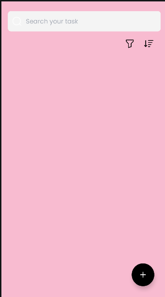
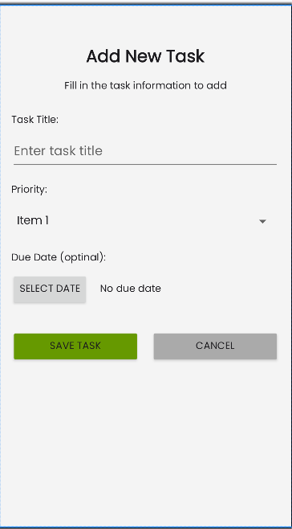
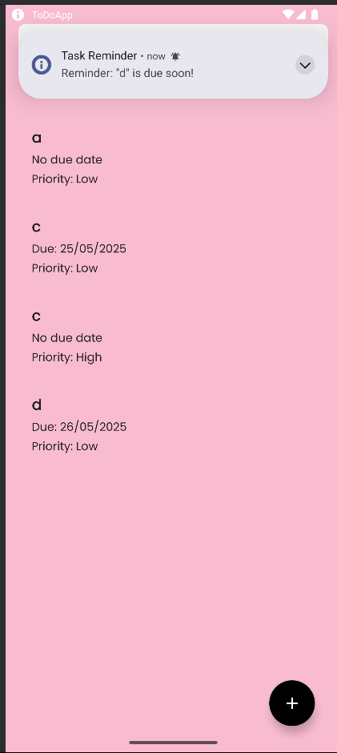

#📝 ToDoApp

A modern **To-Do List** app built using **Kotlin**, **Jetpack libraries**, and **MVVM architecture**. This app allows users to create, edit, delete, filter, and sort tasks with priorities. It demonstrates the use of modern Android development tools and best practices.

---

## 🚀 Features

- ✅ Add, update, and delete tasks
- 🔍 Real-time search functionality
- 🎯 Sort tasks alphabetically (A-Z / Z-A)
- 📊 Filter tasks by priority (Low, Medium, High)
- 🧠 MVVM architecture with Repository pattern
- 💾 Room Database for persistent local storage
- 🔁 Undo delete with Snackbar
- 🧪 Lifecycle-aware components
- ☕ Built with Kotlin and Jetpack components

---

## 🧰 Built With

- [Kotlin](https://kotlinlang.org/)
- [Android Jetpack](https://developer.android.com/jetpack)
    - ViewModel 
    - StateFlow
    - Navigation Component
    - Room Persistence Library
- [Dagger Hilt](https://dagger.dev/hilt/) - for Dependency Injection
- [RecyclerView](https://developer.android.com/guide/topics/ui/layout/recyclerview)

---

## 📸 Screenshots

### 🏠 Task List Screen

### ➕ Add/Edit Task Screen

### ➕ Reminder Task Screen

---

## 📦 How to Run the App

### Prerequisites

- Android Studio **Giraffe** or newer
- Android SDK 33 or above
- Gradle 8+
- A physical or virtual device (API 30+)

### Steps

1. **Clone the repository**

https://github.com/cocooda/ToDoApp.git

2. **Run MainActivity**
